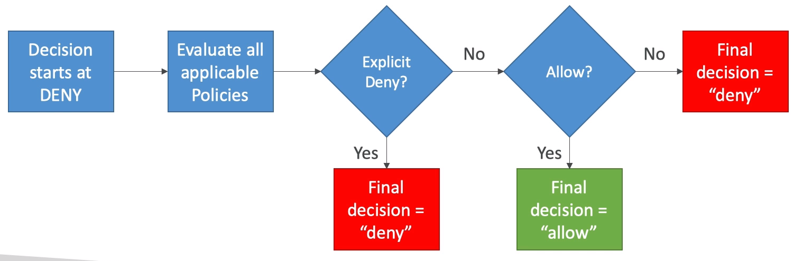
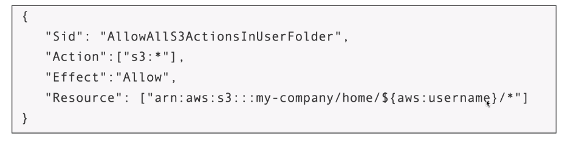
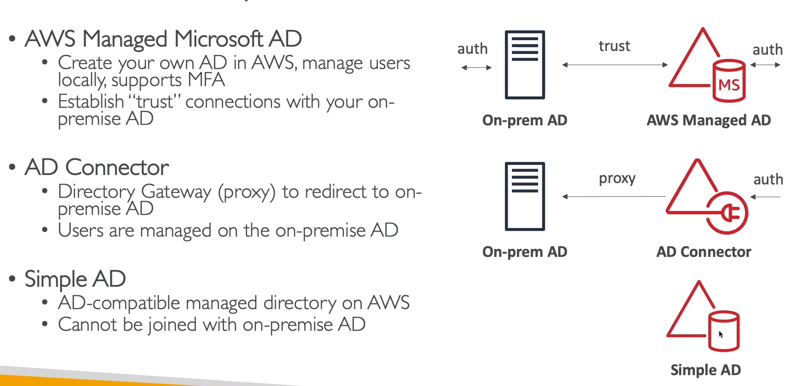

# Advanced Identity

## STS - Security Token Service

- Allows to grant limited and temporary access to AWS resource (up to 1 hour)

- AssumeRole: Assume roles within your account or cross account

- AssumeRoleWithSAML: return credentials for users logged with SAML

- AssumeRoleWithWebIdentity:
    - return cred for users logged with an IdP (FB, Google, ...)
    - AWS recommends against using this, and using Cognito Identity Pools instead

- GetSessionToken: for MFA, from a user or AWS account root user

- GetFederationToken: obtain temporary creds for a federated user

- GetCallerIdentity: return details about the IAM user or role used in the API call

- DecodeAuthorizationMessage: decode error message when an AWS API is denied

### Using STS to assume a role

- Define an IAM role within your account or cross-account

- Define which principals can access this IAM role

- Use STS to retrieve credentials and impersonate the IAM role you have access to (AssumeRole API)

- Temporary credentials can be valid between 15 min to 1 hour

### STS with MFA

- Use __GetSessionToken__ from STS

- Appropriate IAM policy using IAM conditions

- `aws:MultiFactorAuthPresent:true`

- Reminder, GetSessionToken returns:
    - Access ID

    - Secret Key

    - Session Token

    - Expiration Date

## Advanced IAM - Authorization Model Evaluation of Policies, simplified

1. If there's an explicit DENY, end decision and DENY

2. If there's an ALLOW, end decision with ALLOW

3. Else DENY



## IAM Policies & S3 bucket policies

- IAM policies are attached to users, roles, groups

- S3 Bucket Policies are attached to buckets

- When evaluating if an IAM principal can operation X on a bucket, the union of its assigned IAM policies and S3 bucket policies will evaluated

```
IAM policy + S3 Bucket Policy = Total policy Evaluated
```

- Ex1:
    - IAM role attached to EC2 instance, authorizes RW to bucket
    - No S3 bucket policy attached

    - => EC2 instance can read and write to bucket

- Ex2:
    - IAM role attached to EC2 instance, authorizes RW to bucket
    - S3 Bucket policy attached, explicit deny to the IAM role

    - => EC2 instance can not read and write to bucket

- Ex3:
    - IAM role attached to EC2 instance, no S3 bucket permissions
    - S3 Bucket policy attached, explicit RW allow to the IAM role

    - => EC2 instance can read and write to bucket

- Ex4:
    - IAM role attached to EC2 instance, explicit deny S3 bucket permissions
    - S3 Bucket policy attached, explicit RW allow to the IAM role

    - => Ec2 instance can not read and write to bucket

## Dynamic Polices with IAM

- how do u assign each user a /home/<user> folder in an S3 bucket?

- Opt 1:
    - Create an IAM policy allowing matt to have access to /home/matt
    - ...
    - One policy per user

    - This does not scale

- Opt 2:
    - Create one dynamic policy with IAM

    - Leverage the special policy variable ${aws:username}





## Policy Types

- Managed policy
    - Maintained by AWS
    - Good for power users and admin
    - Updated in case of new services / new APIs

- Customer Managed Policy

    - Best practice, re-usable, can be applied to many principals

    - Version controlled + rollback, central change management

- Inline:
    - Strict one-to-one relationship between policy and principal
    - Policy is deleted if u delete the IAM principal

## Granting a user permissions to pass a role to an AWS service

- To config many AWS services, u must pass an IAM role the service (this happens only once during setup)

- For this, need the IAM permission ```iam:PassRole```

- It often coms with ```iam:GetRole``` to view the role being passed

- Can a role be passed to any service?
    - __No, Roles can only be passed to what their *trust* allows__
    - A __trust policy__ for the role that allows the service to assume the role


## Active Directory (AD)

### Microsoft Active Directory

- Database of objects: user accounts, computers, ...
- centralized security maangement, create account

### Directory Services


