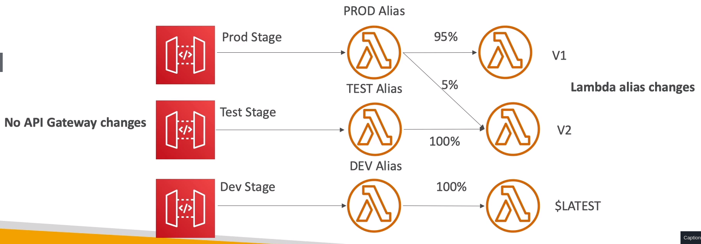

# API Gateway

## Integrations High Level

    - Lambda function
        - Invoke Lambda function

        - Easy way to expose REST API backed by AWS Lambda

    - HTTP:
        - Expose HTTP endpoints in backend

        - Add rate limiting, caching, user authentications, API keys, etc, ...

    - AWS Service
        
        - Expose any AWS API through the API Gateway

        - Ex: Start an AWS step function workflow, post a message to SQS

        - Add authen, deploy publicly, rate control,...

## Endpoint Types

- Edge-Optimized (default): For global clients

    - Requests are routed through the CloudFront Edge localtions (improves latency)

    - The API Gateway still lives in only one region

- Regional:
    - For clients within the same region
    - Cloud manually combine with CloudFront (more control over the caching strategies and the distribution)

- Private:
    - Can only be accessed from you VPC using an interface VPC endpoint (ENI)
    - Use a resource policy to define access

## Deployment Stages

- Make a deployment for changes to be in effect

- Changes are deployed to stages

- Each stage has its own configuration params

- Stages can be rolled back as a history of deployment is kept

## Stage Variables

- Stage variables are like env variables for API Gateway

- Use them to change often changing configuration values

- Use cases:
    - Config HTTP endpoints your stages talk to
    - Pass config params to AWS lambda through mapping templates

- Stage variable config params to AWS lambda through mapping templates

- Stage variables are passed to the context object in Lambda

- Common pattern:
    - Create a stage variable to indicate the corresponding Lambda alias
    - API Gateway will automatically invoke the right Lambda func
    
## Canary

- Choose the % of traffic the canary channel receives

- Metrics and Logs are separate (for better monitoring)

- Possibility to override stage variables for canary

- This is blue/green deployment with Lambda & API Gateway

## Intergation Types

- __Mock__:
    
    - API GW returns response without sending the req to the backend

- __HTTP/AWS (Lambda & AWS services)__:
    - Must config both the integratino req and integration resp

    - Setup data mapping using __mapping templates__ for the req & resp

- __AWS Proxy (Lambda Proxy)__:
    - Incoming request from the client is te input to Lambda

    - The function is responsible for the logic of request / response

    - No mapping template, headers, query string parameters ares passed as arguments

- __HTTP Proxy__:
    - No mapping template

    - HTTP request is passed to the backend

    - HTTP response from the backend is forwarded by API GW

### Mapping Templates

- Mapping templates can be used to modify req/resp

- Rename / modify __query string parameters__

- Modify body content

- Add header

- USes Velocity Template Language (VTL): for loop, if, ...

- Filter output results (remove unnecessary data)

## Swagger / Open API

- Common way of defining REST APIs using API definition as code

- Import existing Swagger/OpenAPI to API GW
    - Method
    - Method Req
    - Integration Req
    - Method Resp
    - + AWS extensions for API GW and setup every single option

- Swagger can be written YAML or JSON

- Using Swagger we can generate SDK for our app

## Cache

- TTL
    - default: 300s
    - range: 0 - 3600

- __Caches are defined per stage__

- Possible override cache setting __per method__

- Clients can invalidate the cache with __header: Cache-Control: max-age=0 (with proper IAM authorization)__

- If you __do not impose an InvalidateCache__ policy (or choose the __Require authorization check box in the console__), __any client can invalidate the API cache__

## Usage Plans & API keys

- If you want to make an API available as an offering ($) to your customers

- Usage Plan:
    - Who can access one or more deployed API stages and methods

    - How much and how fast can access them

    - Use API keys to identitfy clients and meter access

    - Config throttling limits and quota limits that are enforced on individual client

- API keys:
    - Alphanumberic string values to distribute to your customers
    - Can use with usage plnas to control access

    - Throttling limits are applied to the API keys
    - Quotas limits is the overall number of maxium requests

- Configure a usage plan:

    - Create one more more APIs, configure the methods to require an API key, and deploy the APIs to stages

    - Generate or import API keys to distribute to dev app who will be using your API

    - Create the usage plan with the desired throttle and quota limits

    - __Associate API stages and API keys with the usage plan__

- Callers of API must supply an assigned API key in the x-api-key header in requests to API

## Logging & Monitoring

- CW Logs:
    - Enable CW logging at stage level

    - Can override settings on a per API basis

    - Log contains information about request / response body

- X-Ray:
    - X-Ray API Gateway + Lambda gives u the full picture

- CW Metrics
    - Metrics are by stage, Possiblity to enable detailed metrics

    - CacheHitCount & CacheMissCount: efficiency of the cache

    - Count: The total number API requests in a given period

    - IntegrationLatency: The time between when API Gateway replays a request to the backend and when it receives a response from the backend

    - Latency: The time between when API gateway receives a req from a client and when it returns resp to the client. The latency includes the integration latency and other API gateway overhead

    - 4XXError & 5XXError
        - 403: Access Denied, WAF filtered
        - 429: Quota exceeded

        - 502: Bad Gateway Exception, usually for an incompatible output returned from a Lambda proxy integration backend and occassionally for out-of-order invocations due to heavy loads

        - 503: Service Unavailable Exception

        - 504: Integration failure - ex: endpoint request timed-out excaption. API GW requests time out after 29s maxium

- Throttling
    - Account Limit
        - request throttles at 10000 rps across all API

        - Soft limit that can be increased up req

        - Status code: __429 Too Many Request__
    
    - Can set Stage limit & method limits to improve performances

    - Define Usage plans to throttle per customer

    - Just like Lambda concurrency, 1 API that is overloaded, if not limited can cause the other APIs to be throttled

## Security

- IAM:
    - Greate for users / roles already within your AWS account, __+ resource policy for cross account__

    - Handle authentication + authorization

    - Leverage Signature v4

- Custom Authorizer:

    - Great for 3rd party tokens
    
    - Very flexible in terms of what IAM policy is returned

    - Handle Authentication verification + Authorization in the Lambda func

    - Pay per Lambda invocation, results are cached

- Cognito User Pool:
    - Manage your own user pool (can be backed by FB, Google, ...)

    - No need to write any custom code

    - Must implement authorization in the backend

## API Types:

- HTTP API:
    - Low-latency, cost-effective AWS Lambda proxy, HTTP proxy APIs and private integration (no data mapping)

    - support OIDC and OAuth 2.0 authorization, and built-in support for CORS

    - No usage plans and API keys

- REST API:
    - All features (excep Native OpenID connect/ OAuth 2.0)

- WebSocket API:
    - Works with Lambda, DynamoDB or HTTP endpoints
