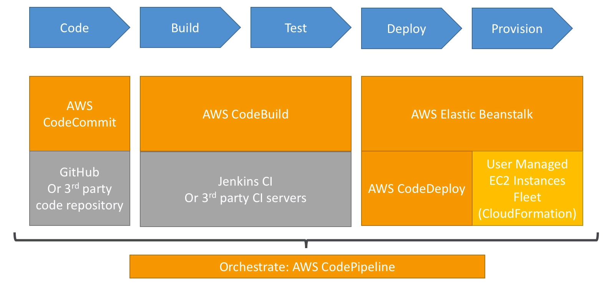
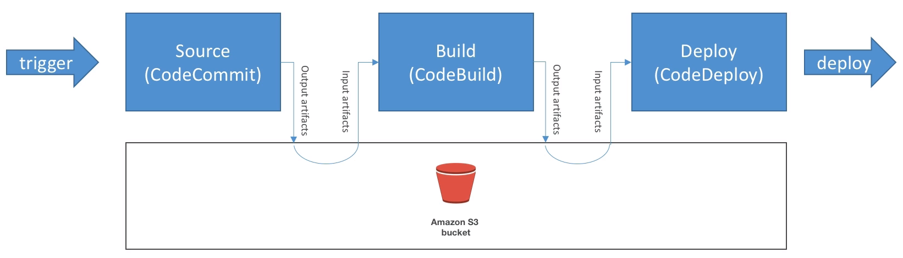

# CICD

## CodeCommit

- Private Git repositories
- Fully managed, highly available

- CodeCommit Security

    - Authentication:
        - SSH keys: users can config SSH keys in their IAM console
        - HTTPS: Done through the AWS CLI authentication helper or generating HTTPS credentials
        - MFA (multi factor authentication):

    - Authorization in Git:
        - IAM policies manage user / roles right to repositories
    
    - Encryption:
        - Repo are automatically encrypted at rest using KMS
        - Encrypted in transit (can only use HTTPS or SSH)

    - Cross Account access:
        - Do not share your SSH keys
        - Do not share your AWS credentials
        - Use IAM role in your AWS account and use AWS STS
    

- CodeCommit Notifications:
    - You can trigger notifications in CodeCommit using __SNS (Simple Notification Service) or Lambda or CloudWatch Event__

    - Use cases for SNS / Lambda notifấy
        - Trigger for pushes that happen in master branch
        - Notify external build system
        - Trigger Lambda function to perform codebase analysis

    - Use cases for CloudWatch Event rules:
        - Trigger for pull request updates
        - Commit comment event
        - CloudWatch Event Rules goes into an SNS topic

## CodePipeline

- Continous Delivery

- Visual workflow

- Source: Github / CodeCommit / Amazon S3

- Build: CodeBuild / Jenkins / etc ...

- Load Testing

- Deploy: AWS CodeDeploy / Beanstalk / CloudFormation / ECS

- Made of stages:
    - Each stage can have sequetail actions and/or parallel actions
    - Stages examples: Build / Test / Deploy / Load Test 
    - Manual approval cna be defined at any stage 

### Artifacts

- Each pipeline stage can create artifacts

- Artifacts are passed stored in S3 and passed on to the next stage

### Troubleshooting

- CodePipeline state changes happen in CloudWatch Events, which can in return create SNS notifications
    - Ex: create events for failed pipelines
    - Ex: create events for cancelled pipelines

- If CodePipeline fails a stage, your pipeline stops and you can get information in the console

- AWS CloudTrail can be used to audit API calls

- If pipeline cant perform an action, make sure the IAM service role attached does have enough permissions (IAM policy)

