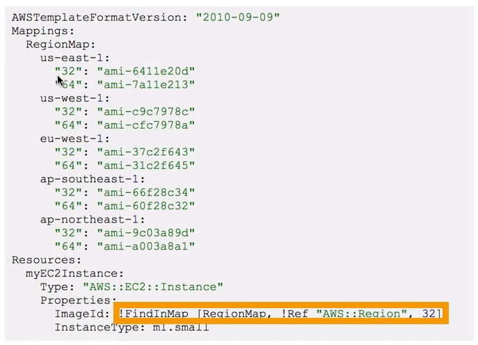

# CloudFormation

## Infrastructure as Code

- Code would be deployed and create / update / delete our infrastructure


## Definition

- CloudFormation is a declarative way of outlining your AWS infrastructure, for any resources (most of them are supported)

- CloudFormation creates resources for you in the right order with the exact configuration that you specify

## Benefits

- Infrastructure as Code

    - No resources are manually created, which is excellent for control
    - Code can be version controlled for example using git
    - Changes to the infrastructure are reviewed through code

- Cost:
    - Each resources within the stack is stagged with an identifier so you can easily see how much a stack costs you

    - Estimate the costs of your resources using the CloudFormation template
    - Saving strategy: in dev, you could automation deletion of templates at 5 PM and recreated at 8 AM safely

- Productivity:
    - Ability to destroy and recreate an infrastructure on the cloud on the fly
    - Automated generation of Diagram for your templates
    - Declarative programming (no need to figure out ordering and orchestration)

- Separation of concern: create many stacks for many apps and many layers

- Dont re-invent the wheel
    - Leverage existing templates on the web
    - Leverage the documentation

## How CloudFormation works

- __Templates have to be uploaded in S3__ and then referenced in CloudFormation

- To update a template, we cant edit previous ones. We have to re-upload a new version of template to AWS

- Stacks are identified by a name

- Deleting a stack deletes every single artifact that was created by CloudFormation

## Building Blocks

- Template components:
    - __Resources__: (Mandatory)
    - Parameters
    - Mappings
    - Outputs
    - Conditionals
    - Metadata

- Templates helpers
    - References
    - Functions

## YAML
- CloudFormation supports YAML and JSON

## Resources

- Resources are the core of your CloudFormation template (mandatory)

- Resources are declared and reference each other

- AWS figures out creation, updates and deletes of resources for us

- Resources types identifiers: ```AWS::aws-product-name::data-type-name```

## Parameters

- Parameters are a way to provide inputs to your AWS CloudFormation template

- They are important to know about:
    - Reuse your templates across the company
    - Some inputs can not be determined ahead of time

- Parameters are extremely powerful, controlled, and can prevent errors from happening in your templates thanks to types

- Pseudo Parameters:
    - AWS offers us pseudo parameters in any CloudFormation template
    - These can be used at any time and are enabled by default
    - Example:
        - AWS::AccountId = 123423
        - AWS::Region = us-east-2


## References

- References can be resources or parameters


## Mappings

- Mappings are fixed variables with your CloudFormation template
- They're handy to differentiate between different environments (dev vs prod), regions, ...

- All the values are hardcodeed with the template



## Outputs

- The outputs section declares optional outputs values that we can import into other stacks (if u export them first)

- Can view outputs in console or CLI

- Useful if u define a network CloudFormation and output the variables such as VPC ID and Subnet ID

- You can not delete a CloudFormation Stack if its outputs are being referenced by another Stack

- Export: exported output names must be unique within your region
    ```
    Outputs:
        StackSSHSG:
            Description: bla
            Value: !Ref MyComSSHSG
            Export:
                Name: SSHSG
    ```

- Import: ```Fn:ImportValue```
    ```
    Resources:
        MyInstance:
            ...
            SecurityGroups:
                - !ImportValue SSHSG
    ```

## Conditions

### Define

- Functions:
    - Fn::And
    - Fn::Equals
    - Fn::If
    - Fn::Not
    - Fn::Or

### Using condition

## Intrisic Functions

- Fn::Ref
    - Parameters => value of parameter
    - Resources => physical ID of resources

    - syntax: ```!Ref```

- Fn::GetAtt
    - Syntax: ```!GetAtt Instance.AvailabilityZone```

- Fn::FindInMap

- Fn::ImportValue

- Fn::Join

- Fn:Sub

- Condition Functions

## Rollback

- Stack Creation Fails:
    - Default: everything rolls back (get deleted)
    - Option to disable rollback and troubleshoot what happened

- stack Update fails:
    - the stack automatically rolls back to the previous known working state
    - Ability to see in the log what happened and error messages

## Nested Stacks

- Allow you to isolate repreaded patterns / common components in separate stacks and call them from other stacks

- Update a nested stack, always update the parent

- Best practice

- Example:
    - LB
    - SG

- Cross Stacks vs Nested Stacks
    - Cross Stacks
        - Helpful when stacks have different lifecycles

    - Nested stacks:
        - Helpful when components must be re-used

## StackSets

- Create, update, or delete stacks across multiple accounts and regions with a single operation

- Admin account to create StackSets