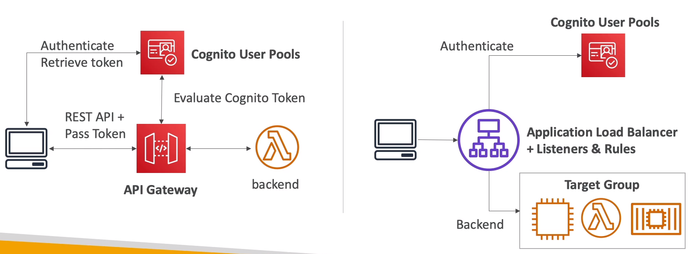

# Cognito

- We want to give our users an identity so that they can interact with our app

- Cognito vs IAM: "hundreds of users", "mobile users", "autheticate with SAML"

## Cognito User Pools (CUP)

- Create a serverless database of user for your web & mobile apps

- Simple login: username / pass combination

- Pass reset

- Email & phone number verification

- Multi-factor authen (MFA)

- Federated Identities: users from FB, Google, SAML, ...

- Feature: block users if their credentials are compromised elsewhere

- Login sends back a JWT

### Integrations

- With API GW, ALB

