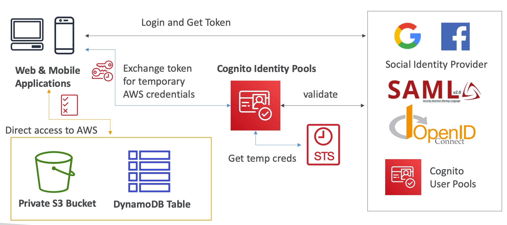
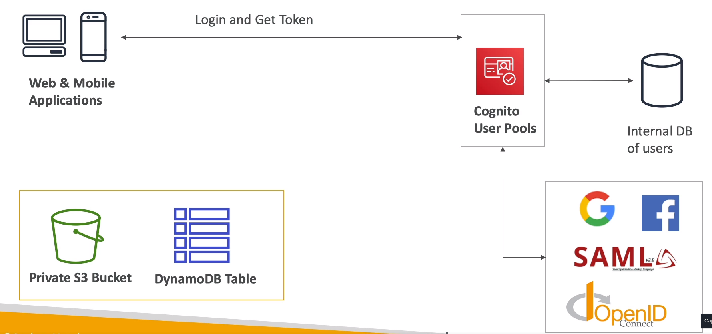

# Cognito

- We want to give our users an identity so that they can interact with our app

- Cognito vs IAM: "hundreds of users", "mobile users", "autheticate with SAML"

## Cognito User Pools (CUP)

- Create a serverless database of user for your web & mobile apps

- Simple login: username / pass combination

- Pass reset

- Email & phone number verification

- Multi-factor authen (MFA)

- Federated Identities: users from FB, Google, SAML, ...

- Feature: block users if their credentials are compromised elsewhere

- Login sends back a JWT

### Integrations

- With API GW, ALB

### Triggers

- Authen Events

- Sign-up

- Messages

- Token Creation

## Cognito Identity Pools (Federated Identities)

- Get identities for users so they obtain temporary AWS credentials

- You identity pool can include:
    - Public providers (login with FB, Amazon, ...)

    - Users in an Amazon Cognito user pool

    - OpenID & SAML

    - Custom login server

    - Cognito Identity Pools allow for unauthenticated access

- __Users can then access AWS services directly or throguh API GW__

    - The IAM policies applied to credentials are defined in Cognito

    - They can be customized besed on the user_id for fine grained control

- IAM roles:
    - Default IAM roles for authen and guest users

    - Define rules to choose the role for each user based on the user's ID

    - You can partition your users' access using policy veriables

    - IAM credentials are obtained by Cognito Identity Pools through STS

    - The roles must have a trust policy of Cognito Identity Pools

## CUP vs CIP

- CUP:
    - Database of users for your web and mobile app
    
    - Allows to federate logins through public social, OIDC, SAML, ...

    - Can customize the hosted UI for authentication (including the logo)

    - has triggers with Lambda during the authentication flow

- CIP:
    - Obtain AWS credentials for your users

    - Login through Public Social, OIDC, SAML & CUP

    - Can be unauthenticated (guests)

    - Users are mapped to IAM roles & policies, can leverage policy veriables

- CUP + CIP = manage user / pass + access AWS services

## Cognito Sync

- Store preferences, config, state of app

- Cross device synchronization (any platform - iOS, Android, etc, ...)

- Offline capability (sync when back online)

- Store data in datasets (up to 1MB), up to 20 datasets to sync

- Push Sync: silenty notify across all devices when identity data changes

- Cognito stream: stream data from cognito into kinesis

- Cognito events: execute Lambda func in response to events

