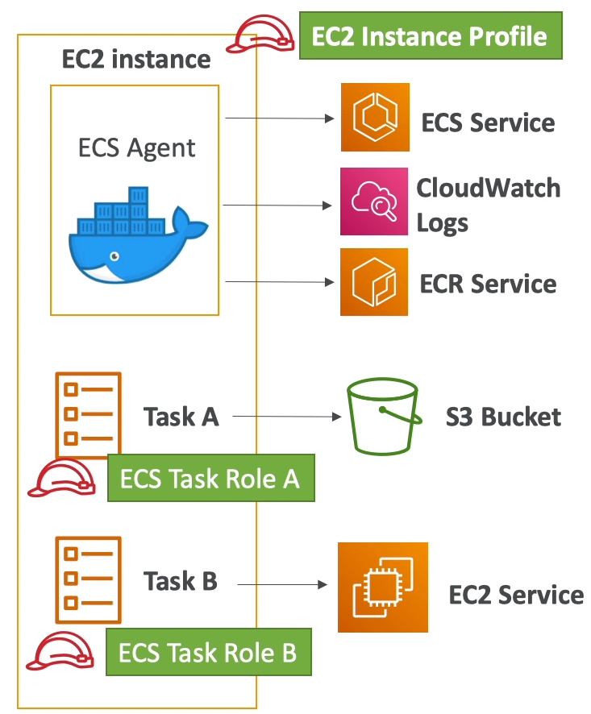

# ECS

# Overview

## Docker vs Virtual Machine

- Resources are shared with the host => many containers on one server

- Docker containers use the same host OS

## ECS Clusters

- ECS clusters are logical grouping of EC2 instances

- EC2 instances run the ECS agent (docker container)

- ECS agents registers the instance to the ECS cluster

- EC2 instances run a special AMI, made sepecifically for ECS

## Task Definition

- Tasks definition are metadata in JSON form to tell ECS how to run a Docker Container
    - Image name
    - Port binding
    - Resource required
    - Env
    - Network

## ECS service

- ECS service help define how many tasks should run and how they should be run

- They ensure that the number of tasks desired is running across our fleet of EC2 instances

- Can be linked to ELB, NLB, ALB if need 

## ECS with ALB

- If we dont specify a host port in the task definition, the host will random the port for containers.

- Application Load Balancer with dynamic port forwarding will forward request to dynamic ports

- EC2 instance security group must allow traffic from the ALB on all ports

## ECR - Elastic Container Registry

- ECR is a private Docker image repository

- Access is controlled through IAM (permission errors => policy)

- AWS ClI:
    - v1: $(aws ecr get-login --no-include-email --region ap-southeast-1)

    - v2: aws ecr get-login-password --region ap-southeast-1 | docker login --username AWS --password-stdin 746634594124.dkr.ecr.ap-southeast-1.amazonaws.com

## Fargate

- When lauching an ECS cluster, we have to create our EC2 instances. If we need to scale, we need to add EC2 instances

- With Fargate, it's all Serverless
- We do not provision EC2 instances

- We just create task definitions and AWS will run our containers for us

- To scale, just increase the task number.

## ECS IAM  roles

- EC2 instance profile:
    - Used by ECS agent
    - Make api calls to ECS service

    - Send container logs to CloudWatch logs
    - Pull docker image from ECR

- ECS task role:
    - Allow each task to have specific role
    - Use different roles for the different ECS Services you run

## Tasks Placement

- When a task of type EC2 is lauched, ECS must determine where to place it, with the constraints of CPU, memory, and available port.

- Similaryly, when a service scales in, ECS need to determine which task to terminate

- To assist with this, you can define a __task placement strategy__ and __task placement constraints__

- Only with EC2 type, not for Fargate

- Process:
    - Task placement strategies are a best effort
    - ECS place tasks, it uses the following process to select container instances:
        - Identify the instances that satisfy the CPU, mem, port requirements in the task definition

        - Identify the instances that satisfy the task placement constrains
        - Identify the instances that satisfy the task placement strategies
        - Select the instances for task placement
    
### Strategies

- Binpack:
    - The least available amount of CPU or mem
    - This minimizes the number of instances in use (cost savings)

- Random

- Spread:
    - The specified value: instanceId, attribute:ecs.availability-zone

- Can mix them together

### Constraints

- DistinctInstance: place each task on a different container instance

- memberOf: places task on instances taht satisfy an expression
    - uses the cluster query language

## Service Auto Scaling

- CPU and RAM is tracked in CloudWatch at the ECS service level

- Target Tracking: target a specific average CloudWatch metric

- Step Scaling: scale based on CloudWatch alarms

- Scheduled Scaling: based on predictable changes

- ECS service scaling (task level) != EC2 auto scaling (instance level)

- Fargate Auto scaling is much easier to setup (because of serverless)

- Doing service auto scaling does not means your cluster will get bigger, we could use Capacity Provider

## Notes:

- ECS does integrate with CloudWatch logs:
    - You need to setup logging at task definition level
    - Each container will have a different log stream

    - EC2 instance profile needs to have the correct IAM permissions

