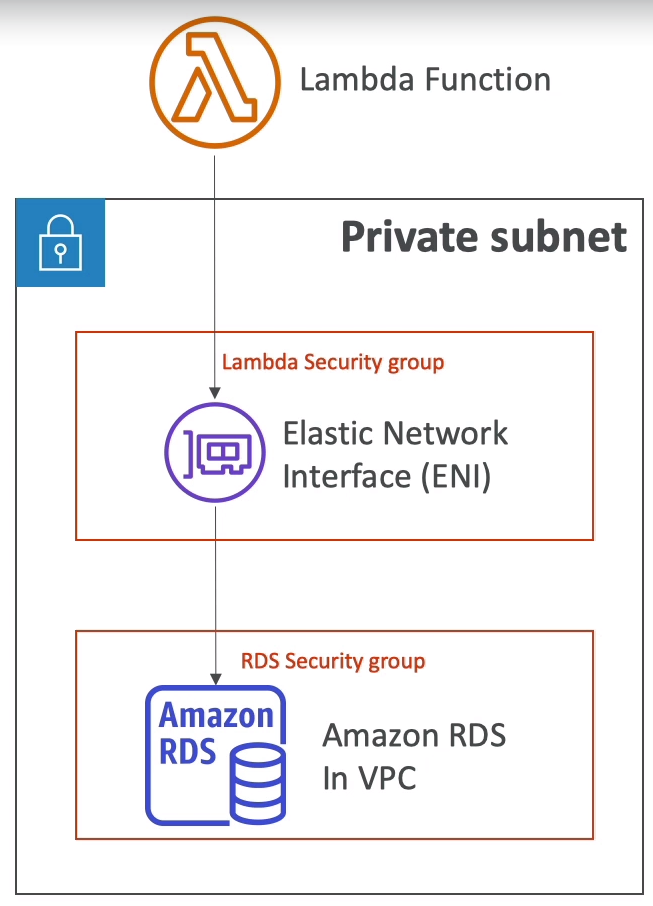
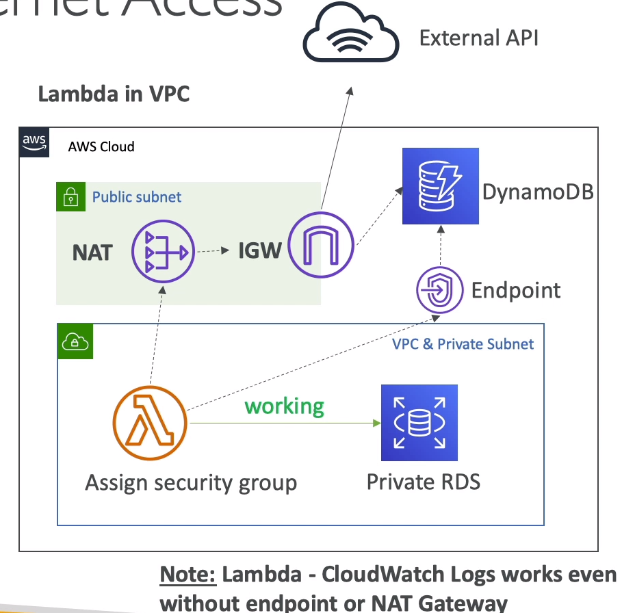

# Lambda

## Serverless

- Serverless is a new paradigm in which developers dont have to manage servers anymore

- Serverless does not mean there are no servers ... it means u just dont manage/provision/see them

- Services:
    - Lambda
    - DynamoDB
    - Cognito
    - API Gateway
    - S3
    - SNS & SQS
    - Kinesis Data firehose
    - Aurora
    - Step functions
    - Fargate

## Lambda

- Virtual functions

- Limited by time - short executions

- Run on-demand

- Scaling is automated

- Benefits:
    - Easy pricing
        - Pay per req and compute time
    - Easy monitoring through CW
    - Easy to get more resources per functions (up to 3 GB)
    - Increasing RAM will also improve CPU and network

- Support
    - Custom Runtime API (community supported, Rust)

- Pricing
    - Pay per calls:
        - First 1M requests are free

        - $0.2 per 1M requests thereafter

    - Pay per duration:
        - 400000 GB-seconds of compute time per month if FREE
        - == 400000 seconds if functions is 1 GB RAM
        - After that $1 for 600,000 GB-seconds

    - very cheap

## Synchronous Invocations

- User Invoke:
    - ELB
    - API Gate
    - CloudFront
    - S3 Batch

- Service invoke:
    - Cognito
    - Step functions

- Other Services:
    - Lex
    - Alexa
    - Kinesis Data Firehose

## Integration with ALB

- The lambda function must be registered in a __target group__

- ALB converts HTTP <-> JSON document
    - ALB can support multi header values (ALB setting)
    - When you enable multi-value headers, HTTP headers and query string params that are sent with multiple values are shown as arrays within the lambda event and response objects

## Lambda@Edge

- U have deployed a CDN using CloudFront

- You can use Lambda@Edge, deploy Lambda functions alongside your CloudFront CDN

    - Build more responsive applications
    - You dont manage servers, lambda is deployed globally
    - Customize CDN content

- Usecases:
    - Web Security and Privacy
    - Dynamic Web App at the Edge
    - Search Engine Optimization (SEO)
    - Intelligently route across origins and data centers
    - Real-time image transform
    - A/B testing
    - User Authentication and Authorization
    - User Prioritization
    - User tracking and analytics

## Asynchronous Invocations

- Services:
    - S3
    - SNS
    - CW Events
    - CodeCommit
    - CodePipeline

    - CW logs
    - SES
    - CF
    - Config
    - IoT, IoT Events

- The events are places in an Event Queue

- Lambda attempts to retry on errors
    - 3 retries
    - 1 min wait after 1st, then 2min wait

- Make sure the processing is __idempotent__ (in case of retries)

- If the function is retried, you will see duplicate logs entries in CW logs

- Can define a DLQ (dead-letter queue) - SNS or SQS for failed processing (need correct IAM permissions)

- Asynchronous invocations allow u to speed up the processing if u dont need to wait for the result 

### S3 Event notifications

- Enable versioning in S3

## Event Source Mapping Streams & Lambda

### Streams & Lambda - Event Source Mapping

- An event source mapping creates an iterator for each shard, processes items in order

- Start with new tiems, from the begining or from timestamp

- Processed items aren't removed from the stream (other consumer can read them)

- Low traffic: use batch window to accumulate records before processing

- You can process multiple batches in parallel
    - up to 10 batches per shard
    - in order processing is still guaranteed for each partition key

### Error handling

- By default, if function returns an error, the entire batch is reprocessed until the func succeeds, or the items in the batch expire

- To ensure in-order processing, processing for the affected shard is paused until the error is reolved
- You can configure the event source mapping to:
    - discard old events
    - restrict the number of retries
    - split the batch on error (to work around lambda timeout issues)

- Discarded events can go to a __destination__

## Event Source Mapping SQS & SQS FIFO

- Event Source Mapping will poll SQS (Long Polling)

- Specify batch size (1-10 msg)

- Recommeded: Set the queue visibility timeout to 6x the timeout of your Lambda function

- To use a DLQ:
    - setup on the SQS queue, not Lambda (DLQ for lambda is only for async invocations)

    - Or use a Lambda destination for failures

## Queues & Lambda

- Lambda also supports in order processing for FIFO queues, __scaling up to number of active message groups__

- For standard queues, items aren't necessarily processed in order

- Lambda scales up to process a standard queue as quickly as possible

- When an error occurs, batches are returned to the queue as individual items and might be processed in a different grouping than the original batch

- Occasionally, the event source mapping might receive the same item from the queue twice, even if no function error occurred

- Lambda deletes items from the queue after theyre processed successfully

- You can configure the sourcequeue to send items to a dead-letter queue if they cant be processed

### Summary

- Kinesis Streams & DynamoDB Streams:
    - One Lambda invocation per stream shard
    - If u use parallelization, up to 10 batches processed per shard simultaneously

- SQS standard:
    - Lambda adds 60 more instances per minute to scale up
    - Up to 1000 batches of messages processed simultaneously

- SQS FIFO:
    - Message with the same groupID will be processed in order
    - the Lambda func scales to the number of active message groups

## Destinations

- Asynchronous invocation: can define destinations for successful and failed event
    - SQS
    - SNS
    - Lambda
    - EventBridge bus

- AWS recommends u use destinations instead of DLQ now

- Event Source Mapping: for discarded event batches
    - SQS
    - SNS

- Note: u can send events to a DLQ directly from SQS

## Execution Role (IAM role)

- Grants the Lambda function permissions to AWS services/ resources

- When u use an event source mapping to invoke your function, lambda uses the execution role to read event data

- Best practice: create one Lambda Execution Role per function

## Resource Based Policies

- Use resource-based policies to give other account and AWS services permissions to use your Lambda resources

- When an AWS service like S3 calls your Lambda func, the resource-based policy gives it access

## Logging & Monitoring

- CW Logs:
    - AWS Lambda execution logs are stored in CW logs
    - Make sure Lambda func has an execution role with an IAM policy that authorizes writes to CW logs

- CW metrics:
    - Lambda metrics are displayed in CW metrics
    - Invocations, Durations, Concurrent Executions
    - Error count, Success Rates, Throttles
    - Async Delivery Failures
    - Iterator Age (Kinesis & DynamoDb streams)

-Tracing with X-Ray
    - Enable in Lambda config
    - Runs X-Ray deamon for u
    - Use SDK in code
    - Ensure Lambda func has a correct IAM execution role
        - AWSXRayDeamonWriteAccess
    
    - Environment variables to communicate with X-Ray
        - _X_AMZN_TRACE_ID
        - AWS_XRAY_CONTEXT_MISSING
        - AWS_XRAY_DEAMON_ADDRESS
    
## Lambda in VPC

- By default, you Lambda func is lauched outside your own VPC (in an AWS owned VPC)

- Therefore it cannot access resources in your VPC (RDS, ElasticCache, ...)

- You must define the VPC ID, the subnets and the security groups

- Lambda will create an ENI (Elastic Network Interface) in your subnets

- __AWSLambdaVPCAccessExecutionRole__

- __Deploying a Lambda func in a public subnet does not give it internet access or a public IP__

- Deploying a L func in a private subnet gives it internet if u have a __NAT Gateway / Instance__

- U can use __VPC endpoints__ to privately access AWS services without a NAT

## Configuration

- RAM:
    - From 128MB to 3008MB in 64MB increments
    - The more RAM u add, the more vCPU credits u get
    - At 1,792MB, a func has the equivalent of one full vCPU
    - After 1,792MB, u get more than one CPU, and need to use multi-threading in your code to benefit from it

- If your app is CPU-bound (computation heavy), increase RAM

- Timeout: default 3s, maxium is 900s (15min)

## Execution Context

- The execution context is temporary runtime environment that initializes any external dependencies of your lambda code

- Great for database connections, HTTP clients, SDK clients, ...

- The execution context is maintained for some time in anticipation of another lambda func invocation

- The next func invocation can re-use the context to execution time and save time in initializing connections objects

- The execution context includes the /tmp directory
    - Max size is 512MB
    - The directory content remains when the execution context is frozen, providing transient cache that can be used for multiple invocations (helpful to checkpoint your work)

## Concurrency and Throttling

- Concurrency limit: up to 1000 concurrent exections

- Can set a "reserved concurrency" at the function level (=limit)

- Each invocation over the concurrency limit will trigger a "throttle"

- Throttle behavior:
    - If synchronous invocation => return ThrottleError - 429
    - If asynchronous invocation => retry automatically and then go to DLQ

- If u need higher limit, open a support ticket

- Issue: There are some app using Lambda func. One app is hit a lot and Lambda scale up to 1000 concurrent executions. So that other app are throttle.

- If the func does not have enough concurrency available to process all events, additional requests are throttled.

- For throttling errors (429) and system errors (500-series), L returns event to the queue and attempts to run the func again for up to 6 hours

- The retry interval increases exponentially from 1 second after the first apptempt to a maximum of 5 min

## Cold Starts & Provision Concurrency

- Cold Start:
    - New instance => code is loaded and code outside the handler run (init)

    - If the init is large (code, dependencies, SDK, ...) this process can take some time
    - First req served by new instances has higher latency than the rest

- Provisioned Concurrency:
    - Concurrency is allocalted before the func is invoked 
    - So the cold start never happens and all invocations have low latency
    - Application Auto Scaling can manage concurrency (schedule or target utilization)

## Dependencies

- Need to install the packages alongside your code and zip it together

- Upload the zip straight to Lambda if less than 50MB, else to S3 first

- AWS SDK comes by default with every Lambda function

## Lambda in Cloud

- Inline func:
    - Very simple

    - Can not include dependencies with inline func

- Through S3:
    - Must store the Lambda zip in S3

    - Must refer S3 zip location in the CloudFormation code
        - S3Bucket
        - S3Key: full path to zip
        - S3ObjectVersion: if versioned bucket

    - If u update the code in S3, but dont update S3Bucket, S3Key or S3ObjectVersion, CloudFormation wont update func

## Layers

- Custom Runtimes
- Externalize Dependencies to re-use them

## Versions

- When u work on a Lambda function, we work on $LATEST

- When we are ready to publish a Lambda function, we create a version

- Versions are immutable

- Versions have increasing version numbers

- Versions get their own ARN

- Version = Code + Config

- Each version of the lambda func can be accessed

## Aliases

- Aliases are "pointers" to Lambda func versions

- We can define a "dev", "test", "prod" aliases and have them point at different lambda versions

- Aliases are mutable

- Aliases enable Blue / Green deployment by assigning weights to Lambda functions

- Aliases enable stable config of our ev

## With CodeDeploy

- CodeDeploy can help you automate traffic shift for Lambda aliases

- Feature is integrated within the SAM framework

- Linear: grow traffic every N minutes until 100%
    - Linear10PercentEvery3Minutes
    - Linear10PercentEvery10Minutes

- Canary: try X percent then 100%

- AllAtOnce: immediate

- Can create Pre & Post Traffic hooks to check the health of Lambda func

## Limits

- Execution:
    - Mem allocation: 128MB - 3008MB (64 increments)
    - Maximum execution time: 900s (15min)
    - Envir variables: 4 KB
    - Disk capacity (/tmp): 512MB
    - Concurrency executions: 1000

- Deployment:
    - Compressed file: 50MB
    - Uncompressed file: 250 MB
    - Can use /tmp directory to load other files at startup
    - Size of environment variables: 4KB
 