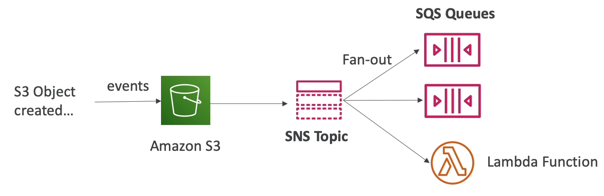

# Messaging

## SQS - Simple Queue Service

- Oldest offering service (over 10 years old)

- Fully managed service, used to __decouple applications__

- Attributes:
    - Unlimited throughput, unlimited number of messages in queue

    - Default retention of messages: __4 days, maxium of 14 days__
    
    - Low latency (<10 ms on publish and receive)

    - Limitation of __256KB per message__ sent

    - Can have duplicate messages (at least once delivery, occasionally)

    - Can have out of order messages (best effort ordering)

- Consumers delete messages after processing them

- Security:
    - Encryption:
        - In-flight encryption using HTTPS 
        - At-rest encryption using KMS keys
        - Client-side encryption if the client wants to perform encryption/decryption itself

    - Access Controls: IAM policies to regulate access to the SQS api

    - SQS access policies (similar to S3 bucket policies)

        - Useful for cross-account access to SQS queues
        - Useful for allowing other services (SNS, S3, ...) to write an SQS queue
    
### Message Visibility Timeout

- After a message is polled by consumer, it becomes __invisible__ to consumers

- By default, the message visibility timeout is __30s__

- That means the message has 30s to be processed

- After the message visibility timeout is over, the message is visible in SQS

- If a message is not processed within the visibility timeout, it will be processed twice

- A consumer could call the __ChangeMessageVisibility__ API to get more time

- If visibility timeout is high (hours), and consumer crashes, re-processing must wait until visibility timeout runs out of time, so it will take time

- If visibility timeout is too low, we may get duplicates

### Dead Letter Queue - DLQ

- The (__MaxiumReceives__) threshold of how many times a message can go back to the queue, after that the message goes into a dead letter queue (DLQ)

- Useful for debugging

- Make sure to process the messages in the DLQ before the expire. Good to set a retention of 14 days in DLQ

### Delay Queue

- Delay a message up to 15min

- Default is 0s

- Can set a default at queue level

- Can override the default on send using DelaySeconds parameter

### Polling Strategies 

- When a consumer requests messages from the queue, it can optionally "wait" for messages to arrive if there none in the queue

- LongPolling decreases the number of API calls made to SQS while __increasing the efficiency and latency of your app, save costs__

- The wait time can be between 1s to 20s

- Long Polling is preferable to Short Polling

- Long Polling can be enabled at queue level or at the API level using __WaitTimeSeconds__

### Extended Client

- How to send large messages?

- Using SQS extended client (java library)

### APIs

- CreateQueue (MessageRetentinoPeriod), DeleteQueue

- PurgeQueue

- SendMessage (DelaySeconds), ReceiveMessage, DeleteMessage

- ReceiveMessageWaitTimeSeconds

- ChangeMessageVisibility

- Batch APIs for SendMessage, DeleteMessage, ChangeMessageVisibility helps decrease your costs

### FIFO

- Limited throughput: 300 msg/s without batching, 3000 msg/s with batching

- Exactly-once send capability (by removing duplicates)

- Message are processed in order by consumer

- De-duplication:
    - interval: 5 mins

    - 2 methods:
        - Content-based deduplication: will do a SHA-256 hash of the message body
        - Explicity provide a message deduplication ID

- Message Grouping
    - If you specify the same value of MessageGroupID in an SQS FIFO queue, you can only have one consumer, and all messages are in order

    - To get ordering at the level of subnet of messages, specify different values for MessageGroupID
        - Messages that share a common Message Group ID will be in order within the group
        - Each Group ID can have a different consumer (parallel processing)

        - Ordering across groups is not guaranteed

## SNS - Simple Notification Service

- Up to __10M subcriptions per topic__

- __100,000 topics limit__

- Subcribers can be:
    - SQS
    - HTTP
    - Lambda
    - Emails
    - SMS messages
    - Mobile Notifications

- How to publish:

    - Topic publish (using SDK)
        - Create a topic
        - Create a subcription
        - Publish to the topic

    - Direct Publish
        - Create a platform application
        - Create a platform endpoint
        - Publish to the platform endpoint
        - Works with google GCM, apple APNS, Amazon ADM, ...

### Security

- Encryption

- Access Controls: IAM policies to regulate access to the SNS API

- SNS Access policies
    - Useful for cross-account to SNS topics
    - Useful for allowing other services (s3) to write an SNS topic

### SNS + SQS: Fan Out

- Push once in SNS, receive in all SQS queues that are subcribers

- Fully decouple, no data loss

- SQS allows for: data persistence, delayed processing and retries of work

- Ability to add more SQS subcribers over time

- Make sure your SQS queue access policy allows for SNS to write

- __SNS can not send messages to SQS FIFO queues (AWS limitation)__

- Usecase: S3 events to multiple queues
    - For the same combination of: __event type__ and __prefix__ you can only have one S3 event rule

    - If u want to send the same S3 event to many SQS queues, use fan-out

    

## Kinesis

- Kinesis i s managed alternative to Apache Kafka

- Great for app logs, metrics, IoT, clickstreams

- Great for "real-time" big data

- Great for streaming processing frameworks (Spark, NiFi, ...)

- Data is automatically replicated to 3 AZ

- Tools:
    - Streams: low latency streaming ingest at scale
    - Analytics: perform real-time analytics on streams using SQL
    - Firehose: load streams into S3, Redshift, ES, ...

- Streams are divided in ordered Shards / Partitions

- Data retention is __1 day by default, can go up to 7 days__

- Ability to reprocess / replay data

- Multiple app can consume the same stream

- Real-time processing with scale of throughput

- Once message is inserted in Kinesis, it cant be deleted (__immutability__)

### Shards

- One stream is made of many different shards

- __1 MB/s or 1000 msg/s at write per shard__

- __2 MB/s at read per shard__

- Billing is per shard provisioned, can have as many shards as u want

- Batching available or per message calls

- The number of shards can evolve over time (reshard / merge)

- __Records are ordered per shard__

### Put Records

- PutRecord API + Partition Key that gets hashed

- The same key goes to the same partition (helps with ordering for specific key)

- Messages sent get a "sequeunce number"

- Choose a partition key that is highly distributed (helps prevent "hot partition")

    - user_id if many users
    - not country_id if 90% of the users are in one country

- Use Batching with PutRecord to reduce costs and increase throughput

- ProvisionedThroughputExceeded if we go over the limits
    - Exceptions:
        - Happens when sending more data (exceeding MB/s or TPS for any shard)

        - Make sure u dont have a hot shard (such as your partition key is bad and too much data goes to that partition)

    - Solution:
        - Retries with backoff
        - Increase shards (scaling)

        - Ensure your partition key is a good one

- Can use CLI, AWS SDK, or producer lib.

### Kinesis Client Lib (KCL)

- Kinesis Client Lib (KCL) enables to consume from Kinesis efficiently

- Rule: each shard is be read only 1 KCL instance. Ex: 4 shards = max 4 KCL instances

- Progress is checkpointed into DynamoDB (need IAM access)

- KCL can run on EC2, Beanstalk, on Premise App

- __Records are read in order at the shard level__

### Security

- Control access / authorization using IAM
- Encryption in flight using HTTPS
- Encryption at rest using KMS
- Possibility to encrypt / decrypt data client side
- VPC endpoints available for kinesis to access within VPC

## Summary

- SQS:
    - For SQS standard, there is no ordering
    - For SQS FIFO, if you dont use a group id, messages are consumed in the order they are sent, with only one consumer

    - To scale the number of consumers, but u want messages to be grouped when they are related to each other, then use group id