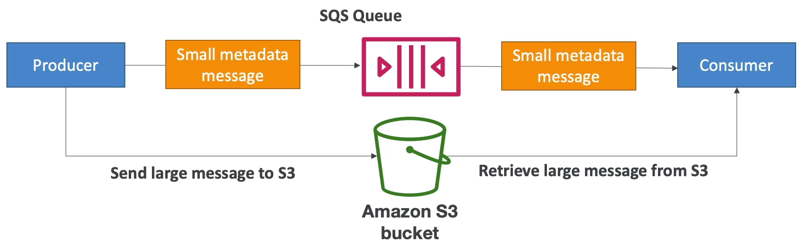

# Messaging

## SQS - Simple Queue Service

- Oldest offering service (over 10 years old)

- Fully managed service, used to __decouple applications__

- Attributes:
    - Unlimited throughput, unlimited number of messages in queue

    - Default retention of messages: 4 days, maxium of 14 days
    
    - Low latency (<10 ms on publish and receive)

    - Limitation of 256KB per message sent

    - Can have duplicate messages (at least once delivery, occasionally)

    - Can have out of order messages (best effort ordering)

- Consumers delete messages after processing them

- Security:
    - Encryption:
        - In-flight encryption using HTTPS 
        - At-rest encryption using KMS keys
        - Client-side encryption if the client wants to perform encryption/decryption itself

    - Access Controls: IAM policies to regulate access to the SQS api

    - SQS access policies (similar to S3 bucket policies)

        - Useful for cross-account access to SQS queues
        - Useful for allowing other services (SNS, S3, ...) to write an SQS queue
    
### Message Visibility Timeout

- After a message is polled by consumer, it becomes __invisible__ to consumers

- By default, the message visibility timeout is __30s__

- That means the message has 30s to be processed

- After the message visibility timeout is over, the message is visible in SQS

- If a message is not processed within the visibility timeout, it will be processed twice

- A consumer could call the __ChangeMessageVisibility__ API to get more time

- If visibility timeout is high (hours), and consumer crashes, re-processing must wait until visibility timeout runs out of time, so it will take time

- If visibility timeout is too low, we may get duplicates

### Dead Letter Queue - DLQ

- The (__MaxiumReceives__) threshold of how many times a message can go back to the queue, after that the message goes into a dead letter queue (DLQ)

- Useful for debugging

- Make sure to process the messages in the DLQ before the expire. Good to set a retention of 14 days in DLQ

### Delay Queue

- Delay a message up to 15min

- Default is 0s

- Can set a default at queue level

- Can override the default on send using DelaySeconds parameter

### Polling Strategies 

- When a consumer requests messages from the queue, it can optionally "wait" for messages to arrive if there none in the queue

- LongPolling decreases the number of API calls made to SQS while increasing the efficiency and latency of your app

- The wait time can be between 1s to 20s

- Long Polling is preferable to Short Polling

- Long Polling can be enabled at queue level or at the API level using __WaitTimeSeconds__

### Extended Client

- How to send large messages?

- Using SQS extended client (java library)

### APIs

- CreateQueue (MessageRetentinoPeriod), DeleteQueue

- PurgeQueue

- SendMessage (DelaySeconds), ReceiveMessage, DeleteMessage

- ReceiveMessageWaitTimeSeconds

- ChangeMessageVisibility

- Batch APIs for SendMessage, DeleteMessage, ChangeMessageVisibility helps decrease your costs

### FIFO

- Limited throughput: 300 msg/s without batching, 3000 msg/s with batching

- Exactly-once send capability (by removing duplicates)

- Message are processed in order by consumer