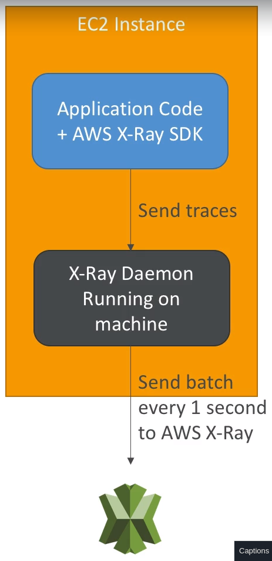
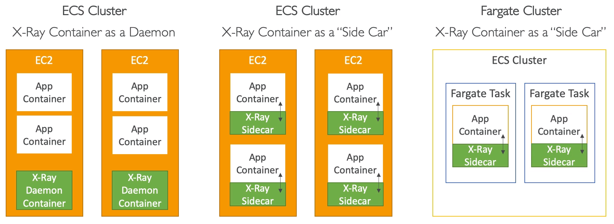

## X-Ray

- Tracing is an end to end way to following a "request"

- Each component dealing with the request adds its own "trace"

- Tracing is made of segments (+ sub segments)

- Annotations can be added to traces to provide extra-info

- Ability to trace:
    - Every request
    - Sample request

- X-Ray security:
    - IAM
    - KMS

### Installation

1. Your code must import the X-Ray SDK

2. Install the X-Ray deamon or enable X-Ray integration
    - X-Ray deamon works as a low level UDP packet interceptor
    - Lambda / other AWS services already run the X-Ray deamon for u
    - Each app must have IAM rights to write data to X-Ray

### Troubleshooting

- EC2:
    - Ensure the EC2 IAM role has proper permissions
    - Ensure the EC2 instance is running the X-Ray Deamon

- Lambda:
    - Ensure it has an IAM execution role with proper policy (AWXX-RayWriteOnlyAccess)
    - Ensure X-Ray is imported in the code

### Instrumentation

- You can modify your app code to customize and annotation the data that the SDK sends to X-Ray, using interceptor, filters, handlers, middleware,...

- Concepts:
    - Segments: each app/ service will send them
    - Subsegments: if u need more details in your segment

    - Trace: segments collected together to form an end-to-end trace
    - Sampling: decrease the amount of requests sent to X-Ray, reduce cost
    - Annotations: KeyValue pairs used to index traces and filtering
    - Metadata: KeyValue pairs, not indexed, not used for searching

- X-Deamon/agent has a config to send traces cross account:
    - correct IAM permissions
    - this allows to have central account for all your app tracing

### Sampling

- Default Rules:
    - The first request __each second__ and __5%__ of any additional requests
        - 1 request per second is the __reservoir__, ensures that at least one trace is recorded each second as long the service is serving requests
        - 5% is the __rate__ at which additional requests beyond the reservoir size are sampled

### X-Ray APIs

- Write API
    - PutTraceSegments: uploads segment docs to X-Ray
    - PutTelemetryRecords: used by X-Ray deamon to upload telemetry:
        - SegmentsReceivedCount
        - SegmentsRejectedCounts
        - BackendConnectionErrors

    - GetSampingRules: Retrieve all sampling rules
    - GetSamplingTargets & GetSampingStatisticSummaries: related to GetSampingRules
    
    - X-Ray daemon needs to have an IAM policy

- Read API

    - GetServiceGraph
    - BatchGetTraces: retrieves a list of traces specified by ID. Each trace is a collection of segment docs that originates from a single request

    - GetTraceSummaries
    - GetTraceGraph

### X-Ray with Beanstalk

- Beanstalk platform include X-Ray deamon

- You can run the deamon by setting an option in beanstalk console or with a config file (in ebextensions/xray-deamon.config)

- Make sure to give your instance profile the correct IAM permissions so that X-Ray deamon can function correctly

### X-Ray with ECS

## CloudTrail

- Provide govermance, compliance and audit for AWS account

- CloudTrail is enabled by default

- Get an history of events / API calls made within AWS account by:

    - Console
    - SDK
    - CLI
    - AWS services

- Can put logs from CloudTrail into CW Logs

- __If a resource is deleted in AWS, look into CloudTrail first__!

## Summary

- CloudTrail:
    - Audit API calls made by users / services / AWS console

- CloudWatch:
    - CW Metrics over time for monitoring
    - CW Logs for storing app logs
    - CW Alarms to send notifications in case of unexpected metrics

- X-Ray:
    - Automated Trace Analysis & Centrail Service Map Visualization
    - Latency, errors and fault analysis
    - Request tracking across distributed system