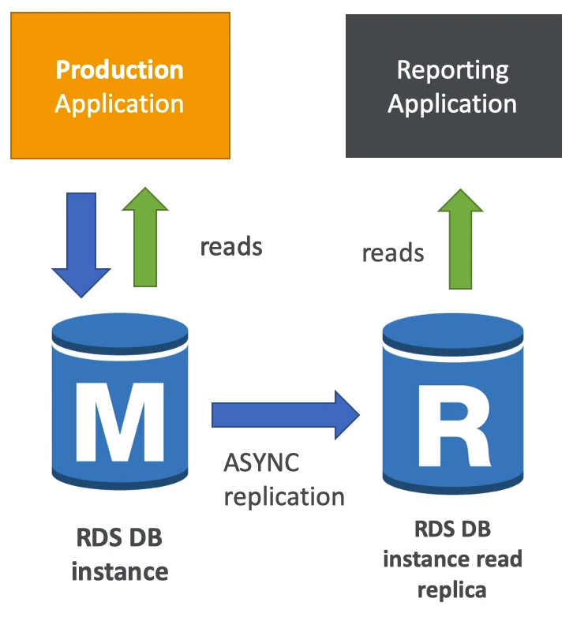
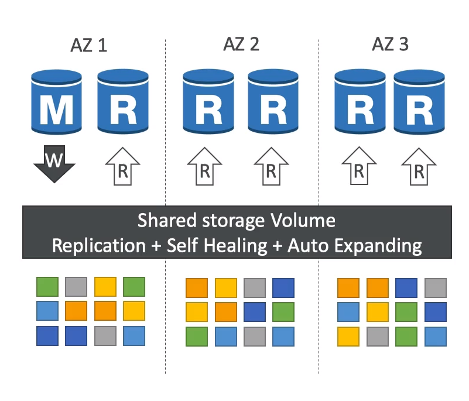
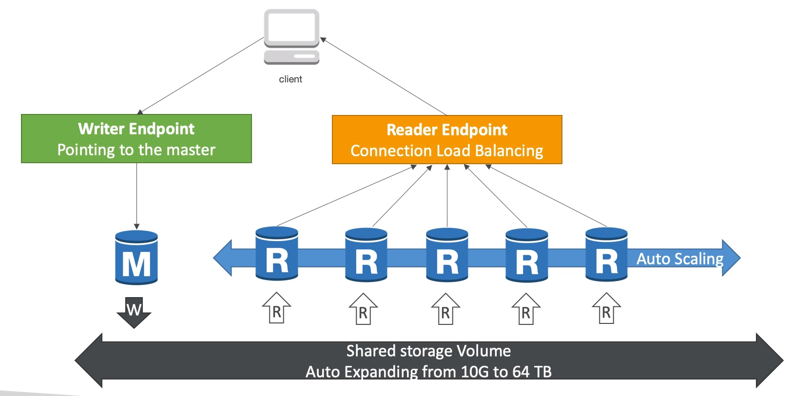
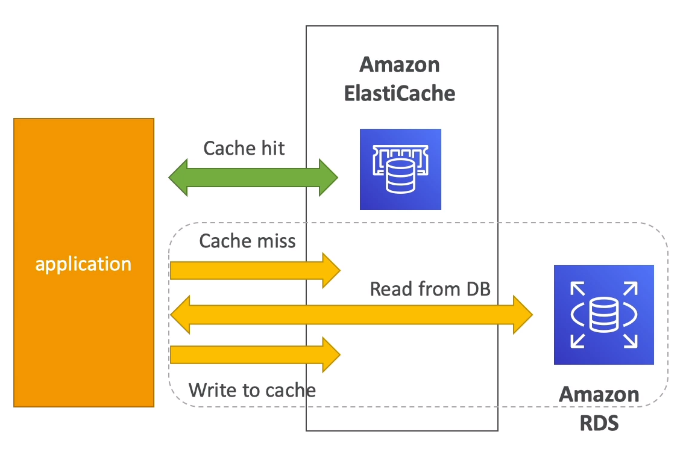
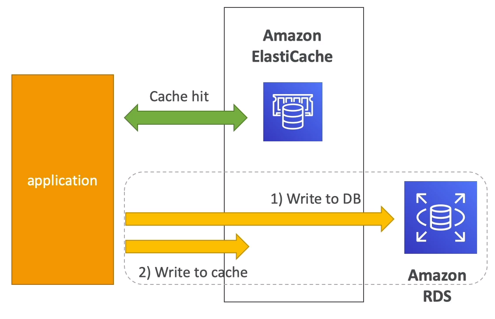

## RDS - Relational Database Service

- Service for DB use SQL (Structured Query Language) as query language

- Engines:
    - Postgres
    - MySql
    - MariaDB
    - Oracle
    - Microsoft SQL server
    - Aurora

- Advantages:
    - Automated provisioning, OS patching
    - Continuous backups and restore to specific timestamp
    - Monitoring dashboards 
    - Read replicas for improved read performace
    - Multi AZ setup for DR (disaster recovery)
    - Maintenance windows for upgrades
    - Scaling capability (vertical and horizontal)
    - Storage backed by EBS (gp2 or io1)

- Can not SSH into RDS

- Backups:
    - Backups are automatically enabled in RDS
    - Daily full backup of the database (during the maintenance window)
    - Transaction logs are backed-up by RDS every 5 minutes
    - ability to restore to any point in time (from oldest backup to 5 minutes age)
    - 7 days retention (can be increased to 35 days)

- DB snapshots:
    - manually triggered by the user
    - retention of backup for as long as you want

- Read replicas (scalabitiy)
    - Only for READ (SELECT)
    - Up to 5 Read replicas
    - With AZ, cross AZ or Cross Region
    - Replication is ASYNC, so reads are eventually consistent
    
    - Replicas can be promoted to their own DB
    - App must update the connection string to leverage read replicas

    - Use case:
        - A production database that is taking on normal load
        - You want to run a reporting application to run some analytics
        - Create a Read Replicas to run the new workload there
        - The production application is unaffected
        
        
    
    - Network cost:
        - Network cost when data goes from one AZ to another.
        - To reducce the cost, you can have your Read Replicas in the same AZ
    
    - RDS Multi AZ (Disaster Recovery)
        - SYNC replication
        - One DNS name - automatic app failover to standby
        - Increase availabitity
        - failover in case of loss of AZ, loss of network, instance or storage failure
        - No manual invervention in apps
        - Not used for scaling
        - Note: The Read Replicas can be set up as Multi AZ for Disaster Recovery (DR)

### Security:
- Encryption:
    - Types:
        - At rest encryption:
            - Possibility to encrypt the master & read replicas with AWS KMS (Key Management System) AES 256 encryption

            - Encryption has to be defined at launch time

            - __If the master is not encrypted, the read replicas can not be encrypted__

            - Transparent Data Encryption (TDE) avaible for Oracle and SQL server

        - In-flight encryption:
            - SSL certificates to encrypt data to RDS in flight

            - Provide SSL options with trust certiticate when connecting to DB

            - To enforce SSL:
                - PostgreSQL: rds.force_ssl=1 in the AWS RDS console (parameter groups)

                - MySQL: using command: GRANT USAGE ON *.* 'mysqluser'@'%' REQUIRE SSL;
    
    - Operations:
        - Encrypting RDS backups:
            - Snapshots of un-encrypted RDS DB are un-encrypted
            - Snapshots of encrypted RDS DB are encrypted
            - Can copy a snapshot into an encrypted one

        - Encrypt an un-encrypted RDS DB
            - Create a snapshot of the un-encrypted DB
            - Copy the snapshots and enable encryption for the snapshot
            - Restore the DB from the encrypted snapshot
            - Migrate apps to the new database, and delete the old DB

- Network:
    - RDS DBs are usually deployed within a private subnet, not in a public one

    - Leveraging security groups - it controls which IP / security group can communicate with RDS

- Access Management:
    - IAM polocies help control who can manage RDS
    - Traditional Username and password can be used to login into the database
    - IAM based authen can be used to login into __MYSQL, Postgres__ RDS only
        - You dont need a password, just an authen token obtained through IAM & RDS API calls
        - Token has lifetime of 15min

        - Benefits:
            - Network in/out must be encrypted using SSL
            - IAM to centrally manage users instead of DB
            - Can leverage IAM roles and EC2 instance profiles for easy integration
    
## Aurora

### Overview

- Proprietary technology from AWS (not open source)

- Supports MySQL, PostGreSQL drivers

- Is AWS cloud optimized and claims 5x performance improvement over MYSQL, 3x Postgre

- Automatically grows in increments of 10, up to 64 TB

- Up to 15 replicas, replication process is faster

- Failover is instantaneous. It is high availability native

- Cost more than RDS (20% more) but is more efficient

### High Availability

- 6 copies of your data across 3 AZ
    - 4 copies of 6 for writes
    - 4 copies of 6 for reads
    - Self healing with peer-to-peer replication
    - Storage is striped across 100s of volumes

- One instance takes writes (master)

- Automated failover for master in less than 30s

- Master + up to 15 aurora Read Replicas

- Support for Cross Region Replication

### How Aurora works?

### Aurora Serverless

- Automated DB instantiation and auto-scaling based on actual usage

- Good for infrequent intermittent or unpredictable workloads

- No capacity planning needed

- Pay per second, can be more cost-effective

## ElasticCache

### Overview

- Caches are in-memory databases with really high performance, low latency

- Helps:
    - Reduce load off of Db for read intensive workloads
    - Make app stateless

- ElastiCache is to get managed Redis or Memcached

- Write scaling using sharding

- Read scaling using Read Replicas

### Redis vs Memcached

- Redis:
    - Multi AZ with Auto-failover
    - Read Replicas to scale reads and have high availability
    - Data durability using AOF persistence
    - Backup and restore features

- Memcached:
    - Multi-node for partitioning of data (sharding)
    - Non persistent
    - No backup and restore
    - Multi-thread architecture
    
### Caching Implementation Considerations

- Lazy Loading / Cache-Aside / Lazy Population:

    

    - Pros:
        - Only requested data is cached, not filled up with unused data
        - Node failure are not fatal (just increased latency to warm the cache)

    - Cons:
        - Cache miss penalty that results in 3 round trips, noticeable delay for that request
        - Stale data: data can be updated in the database and outdated in the cache
    

- Write Through:
    

    - Pros:
        - Data in cache is never stale, reads are quick
        - Write penalty vs Read penalty (each write requires 2 calls)

    - Cons:
        - Missing data until it is added / updated in the DB. Mitigation is implement Lazy Loading strategy as well
        - Cache churn - a lot of the data will be never be read
    
- Always set TTL