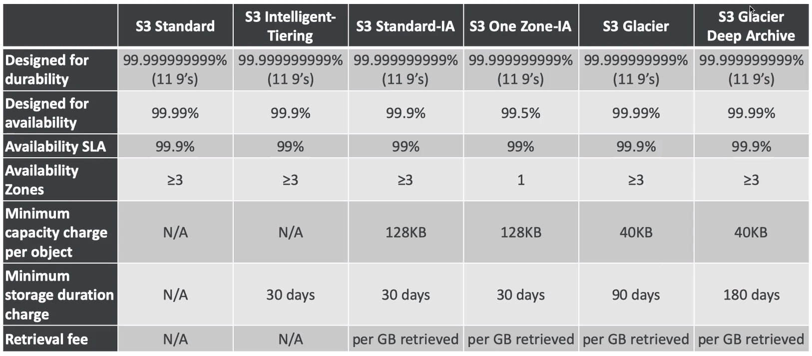
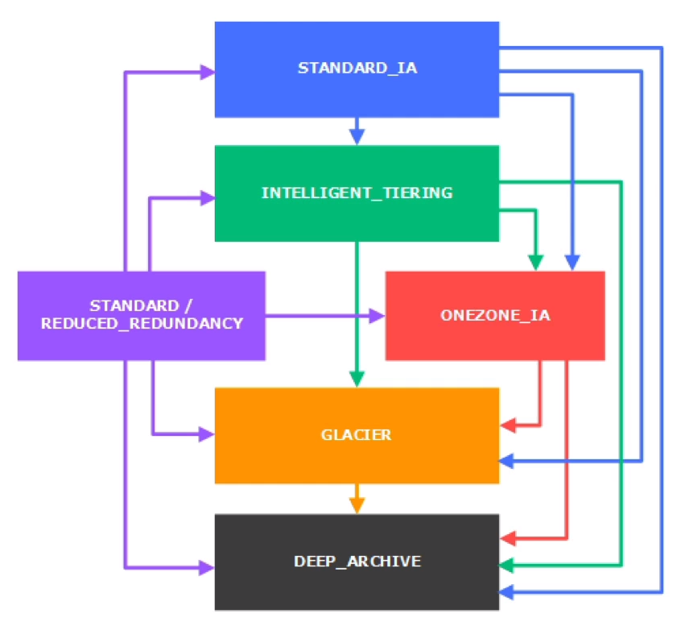
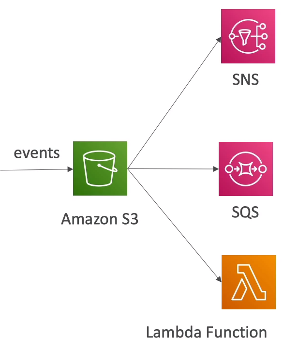

# S3

## Bucket

- Buckets (directories) must have a global unique name

- Buckets are defined at the region level

## Objects

- Objects (files) have a key

- The key is the full path:
    - s3://my-bucket/__file.txt__
    - s3://my-bucket/__myf-folder/file.txt__

- The key is composed of *prefix* + __object name__
    - s3://my-bucket/*myf-folder/*__file.txt__

- No concept of directories with buckets (although the UI will trick you to think otherwise)

- Object values:
    - Max object size: 5 TB
    - if uploading more than 5 GB, must be "multi-part upload"

- Metadata (list of text key/value pairs - system or user metadata)

- Tags: useful for security / lifecycle

- Version:
    - At the bucket level
    - Same key overwrite will increment the version: 1, 2, 3, ...

    - It is best practice to version your buckets:
        - Protect against unintended deletes
        - Easy roll back to previous version

    - Notes:
        - Any file that is not versioned prio to enabling versioning will have version "null"
        - Suspending versioning does not delete the previous versions, every next upload is not versioned.
    
## Encryption

- Server side:
    - SSE-S3:
        - Encryption using keys that are handled & managed by S3

        - Object is encrypted server side. SSE - Sever Side Encryption

        - AES-256 type

        - Must set header: "z-amz-server-side-encryption": "AES356"

    - SSE-KMS:
        - Encryption using keys handled & managed by KMS

        - KMS advantages: user control + audit trail 

        - Object is encrypted server side.

        - Must set header: "z-amz-server-side-encryption": "aws:kms"

    - SS3-C:
        - Server-side encryption using data keys fully managed by client outside of AWS

        - S3 does not store the encryption key you provide

        - __HTTPS must be used__

        - Key must be provideed in HTTP headers, for every HTTP request made

- Client Side:
    - Client Side Encryption:

        - Clients must encrypt data themselves before sending to S3
        - Client must decrypt data themselves when retrieving data from S3

- In transit:
    - S3 exposes:
        - HTTP
        - HTTPS (recommended)

    - HTTPS is mandatory for SSE-C

## Security

- User based:
    - IAM policies: which API calls should be allowed for a specific user from IAM console

- Resource Based:
    - Bucket Policies: bucket wide rules from the S3 console
    - Object Access Control List (ACL)
    - Bucket Access Control List 

- Notes: an IAM principal can access an S3 object if
    - the user IAM permissions allow it OR the resource policy ALLOWS it
    - AND there's no explicit DENY

- Networking:
    - Supports VPC endpoints

- Logging:
    - S3 access logs can be stored in other S3 bucket
    - API calls can be logged in AWS

- User Security:
    - MFA delete: MFA (multi factor authentication) can be required in versioned buckets to delete objects

    - __Pre-signed URL: URLs that are valid only for a limited time (ex: premium video service for logged in users)__

## Policy

- JSON based policies:
    - Resource: buckets and objects
    - Actions: set of API to Allow or Deny
    - Effect: Allow / Deny
    - Principal: the account or user to appl the policy to

- Use S3 bucket for policy to:
    - Grant public access to the bucket
    - Force objects to be encrypted at upload
    - Grant access to another account

- Bucket setting for Block public access:

    - Settings:
        - Block public access to buckets and objects granted through:
            - new ACL
            - any ACL
            - new public bucket or access point policies

        - Block public and cross-account access to buckets and objects through any public bucket or access point policies

    - The settings were created to prevent company data leaks

    - If you know your bucket should never be public, leave these on

    - Account level

## CORS

- An origin is a schema (protocol), host (domain), and port

## Consistency Model

- Read after write consistency for POSTS of new objects

- Eventual Consistency for DELETES and PUTS of existing objects

    - If we read object after updating, we might get the older version

## Replication

- Must __enable versioning in source and destination__

- Cross Region Replication (CRR): compliance, lower latency access, replication across accounts

- Same Region Replication (SRR): log aggregation, live replication between production and test accounts

- Buckets can be in different accounts

- Copying is asynchronous

- Must give proper IAM permissions to S3

- After activating, only new objects are replicated (not retroactive)

- For DELETE operations:
    - a delete marker is not replicated (can be enabled)
    - deleted objects are not replicated

- No chaining of replication

## Storage Classes

- Standard:
    - High durability (99.9999%) of objects across multiple AZ
    - Sustain 2 concurrent facility failures
    - Use cases: big data, mobile & gaming applications, conent distribution, ...

- Standard - Infrequent Access (IA):
    - Suitable for data that is less frequently accessed, but requires rapid access when needed
    - High durability (99.9999%) of objects across multiple AZ
    - Low cost compared to Standard
    - Sustain 2 concurrent facility failures
    - Use cases: as a data store for disaster recovery, backups, ..

- One Zone - Infrequent Access (IA):
    - Data stored in a single AZ
    - 99.5% Availability
    - Low latecy and high throughput performance
    - Low cost compared to standard IA (by 20%)

    - Uses cases: storing secondary backup copies of on-premise data, or storing data you can recreate

- Intelligent Tiering
    - Same low latency and high throughput performance of S3 standard

    - Small monthly monitoring and auto-tiering fee
    - Automatically moves objects between two access tiers based on changing access patterns (move S3 standard to IA)

- Glacier
    - Properties:
        - Low cost object storage
        - Data is retained for longer term
        - Alternative to on-premise magnetic tape storage
        - Cost per storage per month ($0.004 / GB) + retrieval cost
        - Each item in glacier is called Archive (up to 40 TB)
        - Archives are stored in Vaults

    - Glacier:
        - 3 retrieval options
            - Expedited (1 to 5 min)
            - Standard (3 to 5 hours)
            - Bulk (5 to 12 hours)

        - Minimum storage duration of 90 days

    - Glacier Deep Archive:
        - 2 retrieval options:
            - Standard (12 hours)
            - Bulk (48 hours)
        
        - Minimum storage duration of 180 days

## Lifecycle Rules

## Performance

- At least 3500 PUT/COPY/POST/DELETE request per second per prefix in a bucket

- At least 5000 GET/HEAD request per second per prefix in a bucket

- There are no limits to the number of prefixes in a bucket

### KMS Limitation

- If you use SSE-KMS, you may be impacted by the KMS limits

- When u upload, it calls the GenerateDataKey KMS API

- When you download, it calls the Decrypt KMS API

- Count towards the KMS quota per second (5500, 10000, 30000 req/s based on region)

### Optimization

- Multi-part upload:
    - Recommended for file > 100MB, must use for file > 5GB
    - Can help parallelize uploads

- S3 transfer Acceleration (upload only)

    - Increase transfer speed by transferring file to an AWS egde location which will forward the data to the S3 bucket in the target region

    - Compatible with multi-part upload

- Byte-range fetches
    - Parallize GETs by requesting specific byte ranges
    - Better resilience in case of failures

## S3 & Glacier Select

- Retrieve less data using SQL by performing __server side filtering__

- Can filter by rows & columns (simple SQL statements)

- Less network transfer, less CPU cost client-side

## S3 Notifications

- Event name filtering (ObjectCreated, ...)

- Object name filtering possible (*.jpg)

- Use case: generate thumbnails of images uploaded to S3

- If two writes are made to a single non-versioned object at the same time, it is possible that only a single event notification will be sent.

- If u want to ensure that an event notification is sent for every successful write, u can enable versioning on ur bucket

## Athena

- Serverless service to perform analytics directly against S3 files

- Uses SQl language to query the files

- Has a JDBC / ODBC driver

- Charged per query and amount of data scanned

- Supports CSV, JSON, ORC, Avro, and Parquet (built on Presto - Query Engine)

- Uses cases: Business intelligence / analytics / reporting, analyze & query VPC flow logs, ELB logs, Cloudtrail, ...

- Examp tip: Analyze data directly on S3 => use Athena

## S3 Object Lock & Glacier Vault Lock

- S3 Object Lock
    - Adopt a WORM (Write Once Read Many)

    - Block an object version deletion for a specified amount of time

- GlacierVault Lock is the same

- Helpful for compliance and data retention