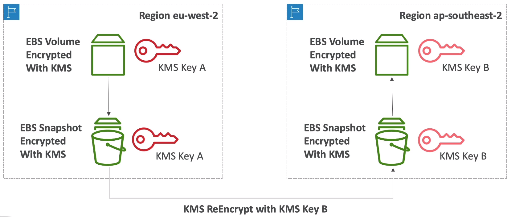
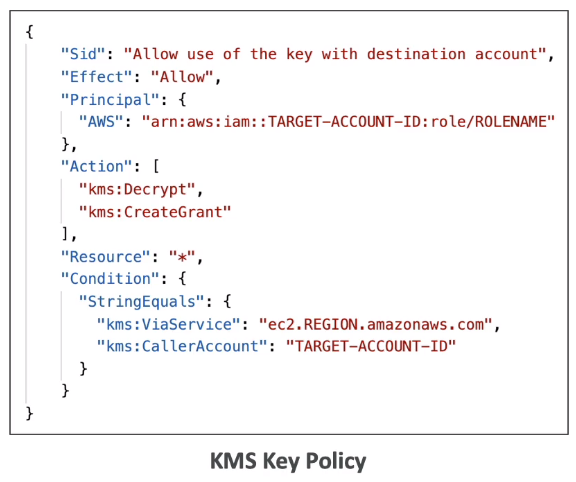
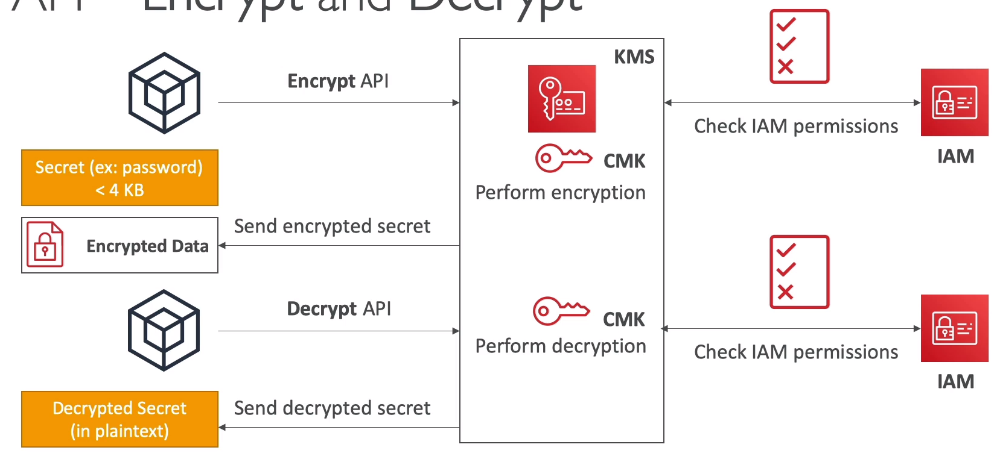

# Security

## Encryption

- Encryption in flight (SSL)

- Server side encryption at rest

- Client side encryption

## KMS (Key Management Service)

- Anytime you hear "encryption" for an AWS service, its most likely KMS

- Easy way to control access to your data, AWS manages keys for us

- Full integrated with IAM for authorization

- Seamlessly integrated into:
    - EBS
    - S3
    - Redshift
    - RDS
    - SSM

- But u can also use the CLI/SDK

  
- Customer Master Key (CMK) types:

    - Symmetric (AES-256 keys)
        - First offering of KMS, single encryption key that is used to encrypt and decrypt

        - AWS services that are integrated with KMS use Symmetric CMKs

        - Neccessary for envelope encryption

        - You never get access to the key unencrypt (must call KMS API to use)

    - Asymmetric (RS & ECC key pairs)

        - Public (encrypt) and private key pair

        - Used for encrypt/decrypt or sign/verify operation
        - the public key is downloadable, but u cant access the private key unencrypted 

        - Use case: encryption outside of AWS by users who cant call the KMS API

- Fully manage the keys and policies:
    - Create

    - Rotation policies

    - Disable

    - Enable

- Audit key usage (using CloudTrail)

- Three types of Customer Master Keys (CMK)
    - AWS managed service default CMK: free

    - User keys created in KMS: $1/mon

    - User keys imported: $1/mon

    - pay for API call to KMS ($0.03/1000 calls)
    
- Anytime you need to share sensitive information... use KMS
    
    - DB passwords

    - Credentials to external service

    - Private Key of SSL cert

- The value in KMS is that the CMK used to encrypt data can never be retrieved by the user, and the CMK can be rotated for extra security

- __Never ever store your secrets in plaintext, especially in your code__

- Encrypted secrets can be stored in the code / env variables

- __KMS can only help in encrypting up to 4KB of data per call__

- To give access to KMS to someone:
    - Make sure the Key policy allows the user

    - Make sure the IAM policy allows the API calls

### Copying Snapshots across accounts

- Key bound to a specific region

### Key Policies

- Control access to KMS keys, similar to S3 bucket policies

- Difference: u can not control access without them

- Default KMS Key Policy:
    - Creatd if u dont provide a specific KMS Key Policy

    - Commplete access to the key to the root user = entire AWS account

    - Gives access to the IAM policies to KMS key

- Custom KMS Key Policy
    - Define users, roles that can access the KMS key
    
    - Define who can administer the key

    - Useful for cross-account access of your KMS key

### Copying Snapshots across accounts

- Create a Snapshot encrypted with your own CMK

- __Attach a KMS Key Policy to authorize cross-account access__

- Share the encrypted snapshot

- Create a copy of the snapshot, encrypt it with a KMS Key in your account

- Create a volume from the snapshot

### How KMS works?

### Envelop Encryption

- KMS Encrypt API call has a limit of 4 KB

- If u want to encrypt >4KB, we need to use Envelope Encryption

- The main API that will help us is __GenerateDataKey__ API

- Encryption in client side

### SDK

- __Data Key Caching__
    - Re-use keys instead of creating new ones for each encryption

    - Helps with reducing the number of calls to KMS with a security trade-off

    - Use LocalCryptoMeterialsCache (max age, max bytes, max number of messages)

### Summary 

- __Encrypt__: encrypt up to 4KB of data through KMS

- __GenerateDataKey__: generates a unique symmetric data key (DEK)
    - Returns a plaintext copy of data key

    - AND a copy that is encrypted under the CMK that u specify

- __GenerateDataKeyWithPlaintext__:
    - Not for envelope encryption

    - Generate a DEK to use at some point in the future

    - DEK that is encrypted under the CMK that u specify (must use decrypt later)

- Decrypt: decrypt up to 4KB of data (including DEKs)

- GenerateRandom: returns a random byte string

- Limits:
    - When u exceed a request quota, u get a ThrottlingException

    - For cryptographic operations, they share a quota

    - This includes request made by AWS on your behalf

    - Resolving:

        - To respond, use __exponential backoff__

        - For GenerateDataKey, consider using DEK caching from encrption SDK

        - Can request a Request Quotas increase through API or AWS support

## S3 Security

### SSE-KMS

- SSE-KMS: encryption using keys handled & managed by KMS

- KMS advantages: user control + audit trail

- Object is encrypted server side

- Must set header: "x-amz-server-side-encryption": "aws:kms"

- SSE-KMS leverages the __GenerateDataKey__ & Decrypt KMS API calls

- These KMS API calls will show up in cloudtrail, helpful for logging

- To perform SSE-KMS, u need:

    - __A KMS Key policy that authorizes the user / role__

    - __An IAM policy that authorizes access to KMS__

    - Otherwise u will get an access denied error

- S3 calls to KMS for SSE-KMS count against your KMS limits

    - If throttling, try exponential backoff

    - If throttling, u can request an increase in KMS limits

    - The service throttling is KMS, not S3

### Policies

- Force SSL: __deny HTTP with aws:SecureTransport = false__

- Force Encryption of SSE-KMS:
    - Deincorrect encryption header (aws:kms)
    - Deny no encryption header to ensure objects are not uploaded un-encrypted

## Parameter Store

- Secure storage for config and secrets

- Optional Seamless Encryption using KMS

- Version tracking of config

- Config management using path & IAM

- Notifications with CloudWatch events

- Integration with CloudFormation

### Parameter policies

- Allow to assign a TTL to a param to force updating or deleting sensitive data such as pass

- Can assign multiple policies at a time

## Secrets Manager

- Newer service, meant for storing secrets

- Capability to force __rotation of secrets__ every X days

- Automate generation of secrets on rotation (uses Lambda)

- __Integration with RDS__

- Secrets are encrypted using KMS

- Mostly meant for RDS

## Secret Manager vs Parameter Store

- Secrets Manager ($$$):

    - More expensive
    
    - Automatic rotation of secrets with AWS lambda

    - KMS encryption is mandatory

    - Can integration with CloudFormation

- SSM parameter store ($):
    - Simple API

    - No secret rotation

    - KMS encryption is optional

    - Can integration with CloudFormation

    - Can pull a Secrets Manager secret using the SSM param store API

## CW Logs

- Can encrypt CW logs with KMS keys

- Encryption is enabled at the log group level, by associating a CMK with a log group, either when u create the log group or after it exists

- Can not associate a CMK with a log group using the CW console

- You must use the CW Logs API via CLI
    - __associate-kms-key__: if log group already exists
    - __create-log-group__: if log group does not exists yet

## Codebuild Security

- To access resources in your VPC, make sure u specify a VPC config for your CodeBuild

- Secrets in CodeBuild

- Dont store them as plaintext in env variables

- Instead:
    - env var can ref param store
    - env var can ref secrets manager