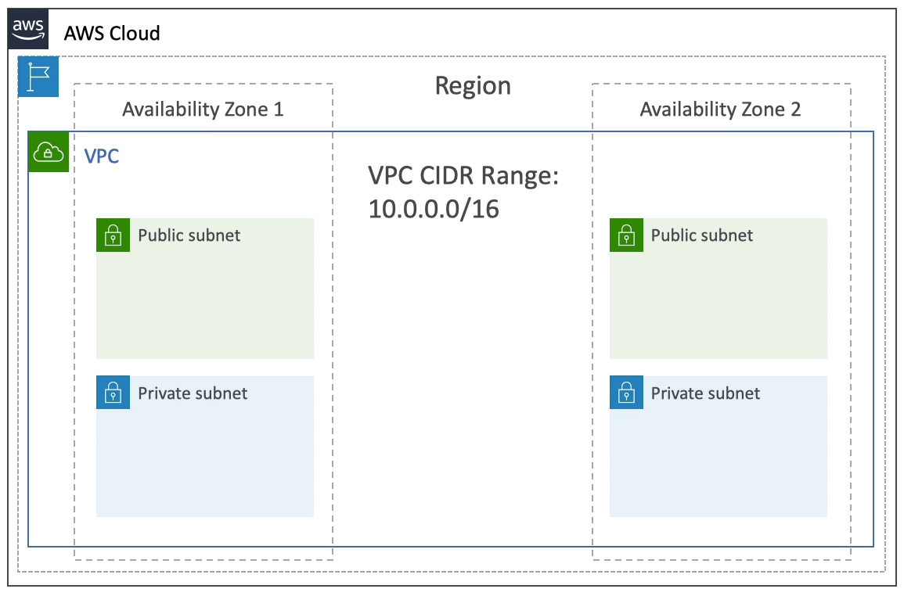
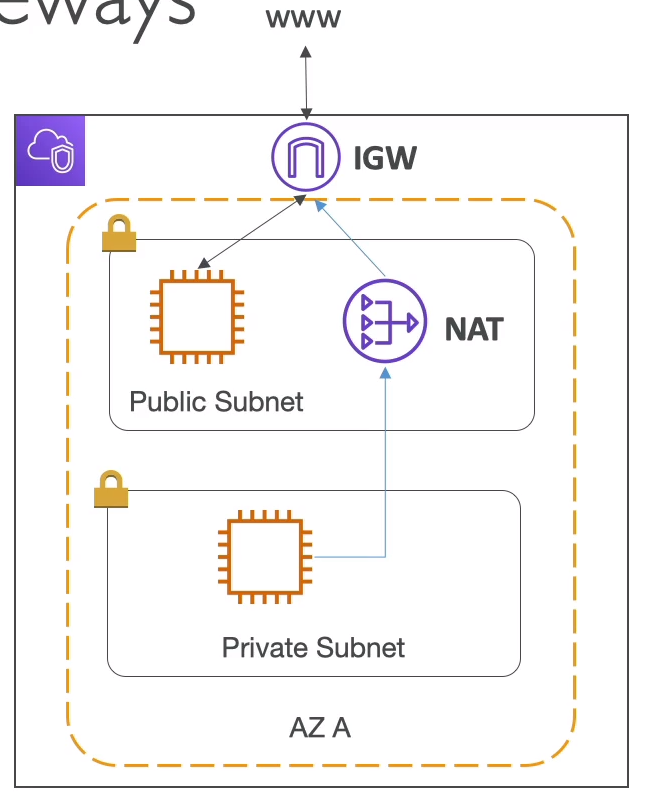
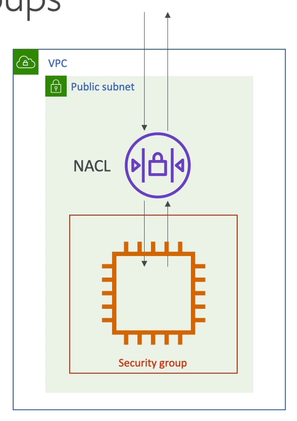
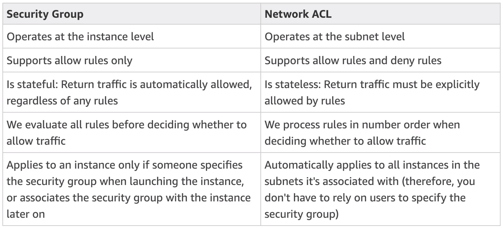
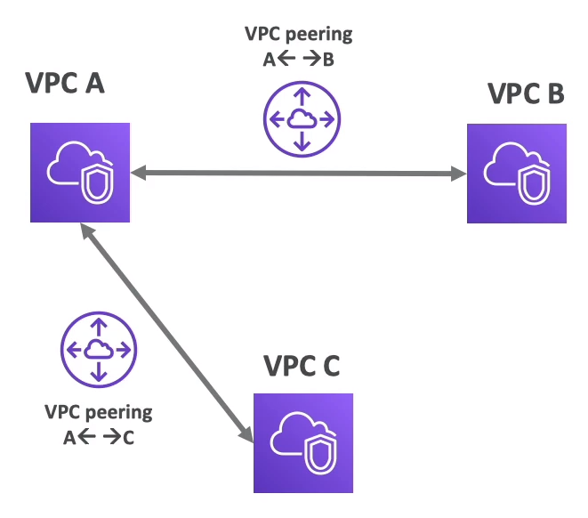
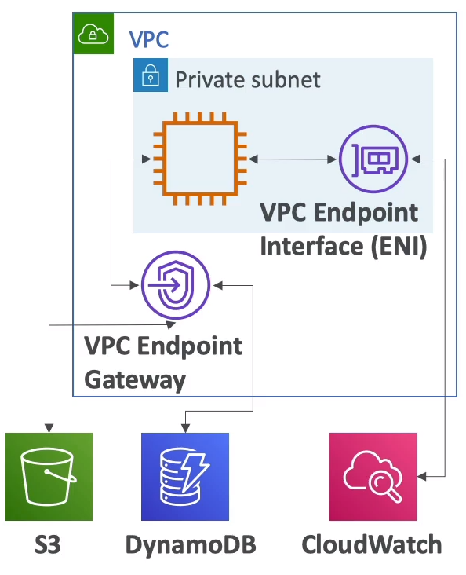
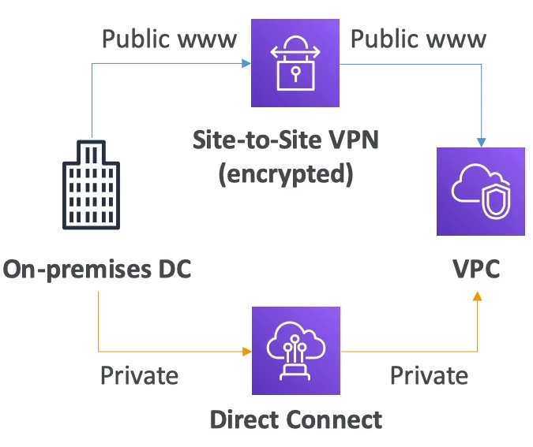

# VPC - Virtual Private Cloud

## Overview

- __VPC__: private network to deploy your resources (Regional resource)

- __Subnets__ allow you to partition your network inside your VPC (AZ source)

- A __public subnet__ is subnet that is accessible from the internet

- A __private subnet__ is subnet htat not accessible from the internet

## Internet Gateway & NAT Gateways

- __Internet Gateway (IGW)__ helps our VPC instances connect with the internet. (at the VPC level)

- Public subnet have a route to the IGW

- __NAT Gateway (AWS-managed) or NAT instances (self-managed)__ allow your instances in your private subnets to access the internet while remaining private

## ACL vs Secrity Group

- Network ACL:
    - A firewall which controls traffic from and to subnet
    - Can have ALLOW and DENY
    - Subnet level
    - Rules only include IP addresses

- Security Group:
    - A firewall that controls traffic to and from an ENI / an EC2 instance
    - only ALLOW rules
    - Rules include IP addresses and other security groups

## Flow Logs

- Capture information about IP traffic going into interfaces:
    - VPC flow logs
    - Subnet flow logs
    - Elastic Network Interface flow logs

- Helps to monitor and troubleshoot connectivity issues

- Capture network info from AWS managed interface too: ELB, EC, RDS, Aurora, etc...

- VPC flow logs data can go to S3 / CloudWatch logs

## VPC peering

- Connect two VPC with non overlapping IP ranges, non transitive

## Endpoints

- Endpoints allow __instances to connect to AWS services using a private network instead of the public www network__

- This gives you enhanced security and lower latency to access AWS services

- Only used within your VPC

## Site to Site VPN & Direct Connect

- Note: Site-to-site VPN and Direct Connect can not access VPC endpoints
